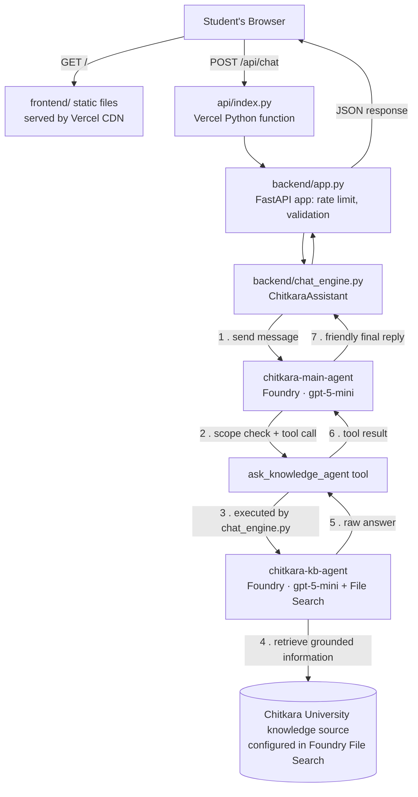

# UniAssist-Ai — Chitkara University FAQ Chatbot

> **UniAssist-AI** is a production-deployed university FAQ assistant for
> Chitkara University, Punjab. It uses Microsoft Foundry Agent Service,
> grounded retrieval, and a two-agent architecture to provide answers
> from a curated university knowledge base.

### Key Features

- 🎓 Chitkara University-focused FAQ assistant
- 🤖 Two-agent Microsoft Foundry architecture
- 📚 Grounded responses using File Search
- 🔎 University answers grounded in the configured knowledge base
- 💬 Conversational follow-up support
- 🌐 Deployed on Vercel
- 🔐 Microsoft Entra ID authentication
- ⚡ FastAPI backend with lightweight frontend


## Demo

🌐 **Live application:** https://chitkara-faq.vercel.app

💻 **Source code:** https://github.com/AashnaTyagi/chitkara-faq

### Example questions

- What are the hostel facilities at Chitkara University?
- What is the fee structure?
- What are the admission requirements?
- When are examinations conducted?
- What courses are available?


---

## Table of contents

- [What this project does](#what-this-project-does)
- [Architecture](#architecture)
- [Tech stack](#tech-stack)
- [Project structure](#project-structure)
- [Planning / build stages](#planning--build-stages)
- [Run locally](#run-locally-windows-cmd)
- [Deploy to Vercel](#deploy-to-vercel-current-production-setup)
- [Deploy to Render (alternative)](#deploy-to-render-alternative)
- [Cost guardrails](#cost-guardrails)
- [Security](#security)
- [Limitations](#limitations)
- [Roadmap / possible next steps](#roadmap--possible-next-steps)

---

## Problem

University information is spread across multiple documents and
web pages, making it difficult for students to quickly find reliable
answers to common questions.

## Solution

UniAssist-AI provides a conversational interface where students can
ask university-related questions in natural language. Responses are
grounded in a curated Chitkara University knowledge base, rather than
being generated from unrestricted web search.


## What this project does

Students ask questions about Chitkara University (admissions, fees, hostel, exams, etc.) through a plain chat interface. The question is handled by the **Main Agent**, which checks whether it is within the university's scope and, when factual university information is required, delegates retrieval to the **Knowledge Base Agent**. The Knowledge Base Agent retrieves information from the configured Chitkara knowledge source through File Search. The Main Agent then turns the retrieved information into a friendly, formatted reply. For questions outside the supported university scope, the system responds without attempting to provide unsupported university facts.

There is **no application database** in the current implementation. University knowledge is maintained in Microsoft Foundry through the configured indexed knowledge source, while conversation state is handled through Foundry's conversation infrastructure. The FastAPI backend acts as a thin, stateless application layer rather than storing the university knowledge locally.

This allows the same deployed application to be accessed from different devices without requiring a local database or synchronized knowledge files.


## Architecture



### Data and State

The application does not use a local application database. The configured Chitkara knowledge source is maintained in Microsoft Foundry and accessed through File Search, while conversation state is handled through Foundry's conversation infrastructure.

The FastAPI backend acts as a stateless application layer. This allows the same application to be deployed across environments such as local development, Vercel, or Render without requiring the university knowledge to be stored locally at runtime.


### Request Flow

1. **Student sends a message** through the frontend.
2. The frontend sends `POST /api/chat` to the Vercel API function.
3. `backend/app.py` validates the request and applies rate limiting.
4. `chat_engine.py` sends the message to the **Main Agent** and manages the agent conversation.
5. The **Main Agent** checks the question's scope and decides whether to call `ask_knowledge_agent`.
6. `chat_engine.py` executes the tool call and forwards the request to the **KB Agent**.
7. The **KB Agent** retrieves relevant information from the configured Chitkara knowledge source using File Search.
8. The retrieved result is returned to the Main Agent as a tool result.
9. The **Main Agent** formats the information into a friendly final response.
10. FastAPI returns the response as JSON and the frontend displays it to the student.


### Agent Responsibilities

| Component                          | Responsibility                                                                              |
| ---------------------------------- | ------------------------------------------------------------------------------------------- |
| **Frontend**                       | Provides the chat interface and sends user messages to the API                              |
| **FastAPI (`backend/app.py`)**     | Handles API requests, validation, and rate limiting                                         |
| **`chat_engine.py`**               | Connects the application to Foundry and orchestrates the agent workflow                     |
| **Main Agent**                     | Performs scope checking, follow-up rewriting, tool selection, and final response formatting |
| **`ask_knowledge_agent`**          | Connects the Main Agent to the Knowledge Base Agent                                         |
| **KB Agent**                       | Retrieves university information using File Search                                          |
| **File Search / Knowledge Source** | Provides the indexed Chitkara University information used for retrieval                     |


### Debugging and Trace Visibility

When `SHOW_AGENT_TRACE=true`, the application exposes the question
forwarded to the KB Agent through `kb_calls` in the API response.
This is useful for debugging the agent hand-off and demonstrating
the retrieval workflow during development or a project demo.


## Tech stack

* **AI orchestration:** Microsoft Foundry Agent Service (two agents, `gpt-5-mini`, File Search tool)
* **Backend:** Python, FastAPI, `azure-ai-projects` SDK, `azure-identity` (Microsoft Entra ID authentication)
* **Frontend:** Vanilla HTML/CSS/JS, `marked.min.js` (Markdown rendering), `purify.min.js` (XSS sanitization)
* **Hosting:** Vercel (production) — static frontend via CDN + Python serverless function for `/api/*`
* **Authentication:** Microsoft Entra ID using `azure-identity` and `DefaultAzureCredential`; service-principal credentials are supplied through deployment environment variables
* **Data and state:** No application database; university knowledge is maintained in the configured Foundry knowledge source, conversation state is handled through Foundry's conversation infrastructure, and rate limiting is implemented in memory per function instance

## Project structure

```
chitkara-faq/
├── api/
│   └── index.py                    # Vercel entrypoint — imports backend/app.py's FastAPI app
├── backend/
│   ├── app.py                      # FastAPI routes: /api/chat, /api/health
│   ├── chat_engine.py              # Two-agent orchestration logic
│   ├── setup_main_agent.py         # One-time/on-change script to create/update the main agent in Foundry
│   ├── cli_chat.py                 # Terminal chat client for local testing/debugging
│   ├── main_agent_instructions.txt # System prompt for chitkara-main-agent
│   ├── requirements.txt
│   └── .env.example
├── frontend/
│   ├── index.html
│   ├── app.js
│   ├── styles.css
│   ├── logo.png
│   └── vendor/                     # marked.min.js, purify.min.js (no CDN dependency)
├── knowledge-base/
│   └── Chitkara_Punjab_KB_upload.md # Knowledge source used to populate the KB agent's File Search index
├── vercel.json                     # Routes /api/* to api/index.py, serves frontend/ as static output
├── render.yaml                     # Alternative deployment target (Render Blueprint)
├── requirements.txt
└── README.md
```


## Planning / build stages

This is roughly the order the project was actually built and deployed in:

1. **Knowledge base prep** — Wrote/curated `Chitkara_Punjab_KB_upload.md` covering admissions, fees,
   hostel, academics, etc. for Chitkara University, Punjab.
2. **Foundry project setup** — Created the `uniassist-resource` Foundry resource and project;
   uploaded the knowledge source and configured chitkara-kb-agent with File Search over the configured source.
3. **Main agent design** — Wrote `main_agent_instructions.txt` to define scope-guarding behaviour,
   follow-up rewriting, and the `ask_knowledge_agent` tool contract; built `chitkara-main-agent` via
   `setup_main_agent.py`.
4. **Backend** — Built `chat_engine.py` (agent orchestration) and `app.py` (FastAPI wrapper: routes,
   validation, per-IP rate limiting) so the two-agent logic is reusable from both a CLI (`cli_chat.py`)
   and a web API.
5. **Frontend** — Plain HTML/CSS/JS chat UI with no build step, so it can be served as static files
   with zero extra tooling.
6. **Local verification** — Ran everything locally via `az login` + `uvicorn app:app --reload` to
   confirm the full request flow (frontend → API → Main Agent → knowledge retrieval → response) worked
7. **GitHub** — Pushed the project to `github.com/AashnaTyagi/chitkara-faq`.
8. **Vercel deployment** —
   - Imported the repo into Vercel.
   - Created an Entra ID service principal (az ad sp create-for-rbac) for server-side authentication and assigned it the Foundry User role on the uniassist-resource scope.
   - Set all required environment variables (Foundry endpoint, agent names, and the three
     `AZURE_TENANT_ID` / `AZURE_CLIENT_ID` / `AZURE_CLIENT_SECRET` values) in Vercel's project settings.
   - Fixed a routing bug where Vercel's auto-detected "FastAPI" framework preset was sending *every*
     path (including the static frontend) to the Python function instead of only `/api/*`. Fixed by
     setting `"framework": null` in `vercel.json` so only the explicit `rewrites` rule applies.
     
   - Verified the live deployment end-to-end at **https://chitkara-faq.vercel.app**.
9. **Collaborator access** — Added a collaborator to the GitHub repo for shared development.

## Run locally (Windows CMD)

```cmd
cd backend
python -m venv .venv
.venv\Scripts\activate
pip install -r requirements.txt
copy .env.example .env
az login --tenant bc9cd8e7-1801-4d9b-9c0d-c39cb60a7a19
python setup_main_agent.py
uvicorn app:app --reload
```

Open http://127.0.0.1:8000

- `python setup_main_agent.py` only needs to run once, and again after editing `main_agent_instructions.txt`.
- `python cli_chat.py` chats in the terminal and prints each main → KB hand-off.
- Locally, auth uses your own `az login` session (`AzureCliCredential`), so leave `AZURE_TENANT_ID` /
  `AZURE_CLIENT_ID` / `AZURE_CLIENT_SECRET` blank or commented out in `.env` — if they're present but
  empty, `DefaultAzureCredential` will try to use them and fail instead of falling back to your CLI login.

## Deploy to Vercel (current production setup)

Live at **https://chitkara-faq.vercel.app**.

or Vercel deployment, the application authenticates to Azure using a Microsoft Entra ID service principal instead of relying on a local az login session.

1. Create the service principal (after `az login` locally):
   ```cmd
   az ad sp create-for-rbac --name uniassist-ai-vercel
   ```
   Save `appId`, `password`, and `tenant` from the output immediately — the password is shown only once.

2. Get the Foundry resource ID and grant the service principal access:
   ```cmd
   az cognitiveservices account list --query "[?name=='uniassist-resource'].id" -o tsv
   az role assignment create --assignee <appId> --role "Foundry User" --scope <resource ID>
   ```

3. Push the repo to GitHub, then in Vercel: **Add New → Project → Import Git Repository**.

4. Leave **Root Directory** as `./`. `vercel.json` already routes `/api/*` to `api/index.py` and
   serves `frontend/` as the static site.

5. Add these Environment Variables before deploying (Production **and** Preview):

   | Key | Value |
   |---|---|
   | `FOUNDRY_PROJECT_ENDPOINT` | `https://uniassist-resource.services.ai.azure.com/api/projects/uniassist` |
   | `MODEL_DEPLOYMENT_NAME` | `gpt-5-mini` |
   | `MAIN_AGENT_NAME` | `chitkara-main-agent` |
   | `KB_AGENT_NAME` | `chitkara-kb-agent` |
   | `SHOW_AGENT_TRACE` | `true` |
   | `MAX_REQUESTS_PER_MINUTE` | `15` |
   | `AZURE_TENANT_ID` | tenant from step 1 |
   | `AZURE_CLIENT_ID` | appId from step 1 |
   | `AZURE_CLIENT_SECRET` | password from step 1 |

6. Deploy.

> **Known gotcha:** if Vercel auto-detects the framework as "FastAPI" during import, it may route
> every path (not just `/api/*`) to the Python function, causing the static frontend route `/` to be
> handled by the Python function instead of serving `frontend/`. Fix: ensure `vercel.json` includes
> `"framework": null` at the top level, so only the explicit `rewrites` rule controls routing, then
> redeploy.

Vercel's rate limit resets per function instance (cold starts can create fresh instances), so MAX_REQUESTS_PER_MINUTE is a soft per-instance guard rather than a hard global limit.

## Deploy to Render (alternative)

Same Entra ID requirement as above. If you already created the service principal for Vercel, reuse
those same three values here.

1. Push this folder to GitHub. In Render choose **New → Blueprint** and select the repo (it reads
   `render.yaml`).
2. When Render asks for secret values, enter `AZURE_TENANT_ID`, `AZURE_CLIENT_ID`, `AZURE_CLIENT_SECRET`
   from the service principal.

Render's free plan may spin down when idle, so the first request after a period of inactivity can experience a noticeable startup delay —
this is why Vercel (no idle sleep for the static frontend, fast cold starts for the function) was
chosen as the primary production target.

## Cost guardrails

- `MAX_REQUESTS_PER_MINUTE` caps messages per visitor (default 15), protecting Azure credits once the
  site is public.
- The KB agent's retrieval is limited to the configured knowledge source, with no open-ended web search, helping keep cost and scope predictable.

  ## Security

* Secrets such as `AZURE_CLIENT_SECRET` are stored as deployment environment variables and should never be committed to Git.
* `.env` files should remain local and be excluded through `.gitignore`.
* Microsoft Entra ID is used for authentication to Azure resources.
* The application applies request validation and rate limiting at the FastAPI layer.
* The frontend sanitizes rendered Markdown using `purify.min.js`.
* Azure credentials are kept on the server side and are not exposed to the browser.

## Limitations

* The knowledge base is limited to the information currently included in the configured Chitkara University source.
* Updating university information requires updating and re-indexing the knowledge source.
* Rate limiting is implemented in memory per Vercel function instance, so it is a soft protection rather than a global distributed rate limit.
* The current application does not use a persistent application database.
* Responses depend on the quality, coverage, and freshness of the configured knowledge source.
* The system is designed for university FAQ-style queries rather than unrestricted general-purpose question answering.

  

## Roadmap / possible next steps

- [ ] Expand the knowledge base document as new FAQs come in, and re-index in Foundry
- [ ] Add a persistent shared store (e.g. Vercel KV or a small Postgres instance) if conversation
      history needs to survive across cold starts or be analyzed later
- [ ] Add a custom domain in Vercel project settings
- [ ] Add basic analytics (e.g. Vercel Speed Insights) to monitor real usage
- [ ] Tighten `ALLOWED_ORIGINS` if the frontend is ever split onto a different domain than the API
- [ ] Add automated tests for API validation, scope handling, tool invocation, and response formatting
- [ ] Add evaluation cases to measure retrieval accuracy and out-of-scope handling
